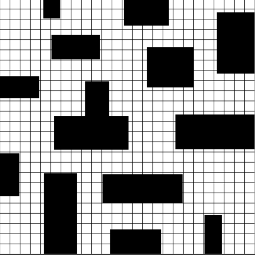

# 路径规划之 A_Star (A*)

A*算法是一种基于启发式搜索的算法，该算法综合了BFS(最佳优先搜索)和Dijkstra算法的优点：在进行启发式搜索提高算法效率的同时，可以保证找到一条最优路径。




## 算法描述

A*算法扩展路径时，在主循环的每次迭代中，基于路当前节点到起点的成本以及将路径一直扩展到目标所需的估计成本来执行此操作。即选择最小化路径:  

> $f(n)=g(n)+h(n)$  

随着路径的扩展，以扩展到的但未计算的节点放入列表$open\_table$, 完成计算的节点放入列表$close\_table$。算法每次从$open\_table$中选择$f(n)$最小的节点作为当前节点开始扩展。一直到找到目标点或者达到最大搜索次数而终止。

该公式包含有一下特征：
> 如果$g(n)=0$, 即只计算当前节点`n`到目标节点`goal`的估计函数$h(n)$, 而不计算起点`start`到当前节点`n`的距离，算法转换为使用贪心策略的最佳优先搜索(BFS), 搜索速度提高，但是路径不是最优的
> 如果$h(n)$不大于当前节点`n`到目标节点`goal`的实际距离，则一定能得到最优解， 且$h(n)$越小，需要计算的节点越多，算法速度降低。
> 如果$h(n)=0$, 即只需求出起点`start`到当前节点`n`的最短路径$g(n)$，而不计算任何评估函数$h(n)$，则转化为单源最短路径问题，即Dijkstra算法，此时需要计算最多的顶点.

其中：  
> $f(n)$: 目标函数, 规划过程即最小化f(n)；  
> $g(n)$: 起点$start$到当前节点$n$的实际距离；    
> $h(n)$: 启发函数, 当前节点$n$到终点$goal$的估计距离；  
> $open\_table$: 记录需要搜寻过的节点列表  
> $close\_table$: 记录已经被搜寻过的节点列表

常用的启发函数$h(n)$一般有:  
+ 曼哈顿距离:
  > $d_{mahattan}=|p1.x-p2.x|+|p1.y-p2.y|$

+ 切比雪夫距离:
  > $d_{chebyshev}=max(|p1.x-p2.x|,|p1.y-p2.y|)$

+ 欧式距离:
  > $d_{euclidean}=\sqrt{(p1.x-p2.x)^2+(p1.y-p2.y)^2}$

+ 对角距离:
  > $d_{diagonal}=(|p1.x-p2.x|+|p1.y-p2.y|)+\sqrt{2}-2\times min(|p1.x-p2.x|,|p1.y-p2.y|)$


## 流程

+ 初始化`A_STAR.__init__`: 初始化地图，对地图图片二值化处理，网格节点划分，若网格内包含障碍物，则该网格节点标记为障碍物:  `Node.is_obs = True`
  
+ 输入需要随机产生的障碍物网格个数(可选);
  
+ 计算起点`qstart`的$h$,$g$,$f$值,这里选择 $h=d_{mahattan}$, $g=d_{diagonal}$计算.将节点放入`open_table`
  
+ 开始迭代, 若迭代次数达到上限或者`open_table`为空, 则退出迭代：  
    + 从`open_table`列表中选择`f`值最小的节点作为当前节点,记为`best_node`
  
    + 若`best_node`为目标节点`goal`, 即找到目标, 遍历`best_node`的父节点链表并逆序, 得到完整路径, 退出算法. 否则继续下一步: 
  
    + 将`best_node`从`open_table`列表弹出, 并放入`close_table`列表中.
 
    + 搜索`best_node`的8个邻接节点`Neighbors`,对其中每个邻接节点`neighbor`:

        + 若该`neighbor`在`close_table`中,或者不可达, 则跳过该`neighbor`,检查下一个邻接节点, 否则继续下一步: 

        + 计算该`neighbor`的新`g`值(`tentative_g`), 即为当前节点`best_node`的`g`值加上, 当前节点`best_node`到该邻接节点`neighbor`的实际距离:  
        `tentative_g = best_node.g + Distance(best_node, neighbor)`

        + 若该`neighbor`不在`open_table`中, 计算该`neighbor`的`g`, `h`, `f`值, 并放入`open_table`中
      
        + 若该`neighbor`在`open_table`中:

            + 若该邻接节点`neighbor`新的`tentative_g`值比已有的`g`值小, 意味着当前节点`best_node`通过该`neighbor`可以更快的到达终点. 
          
            + 更新该`neighbor`节点的`g`值为`tentative_g`,并更新`f`值
           
            + 更新该该`neighbor`节点的父节点为当前节点`best_node`.
              


## 实现

### 数据结构

```python
class Node(object):
    def __init__(self, pos):
        self.pos = pos          # 当前节点的位置坐标
        self.g = float('inf')   # 当前节点的g(n),g_score
        self.h = float('inf')   # 当前节点的的h(n),h_score
        self.f = float('inf')   # 当前节点的的f(n), f_score
        self.p = None           # 当前节点的父节点
        self.is_obs = False     # 当前节点是否是障碍物
```

### 接口

``` python
    '''
    map_path:   地图图片路径
    qstart:     起点坐标 [row, col]
    qgoal:      目标点坐标 [row, col]
    grid_size:  网格大小（用来碰撞检测）
    max_steps:  最大扩展节点数
    '''

    a_star = A_STAR(map_path, qstart, qgoal, grid_size, max_steps)
    
```

### Planning

```python
    def Planning(self):

        color_close = (random.randint(0, 255),
                       random.randint(0, 255),
                       random.randint(0, 255))

        color_open = (random.randint(0, 255),
                      random.randint(0, 255),
                      random.randint(0, 255))

        # input numbers of obstacle grid if necessary
        num = input("input obstacle numbers: ")
        try:
            input_num = eval(num)
            if type(input_num) == int:
                obstacle_set = self.AddObstacle(input_num)
            else:
                return
        except:
            return

        # init qstart node
        self.qstart.g = 0
        self.qstart.h = self.HScore(self.qstart)
        self.qstart.f = self.FScore(self.qstart)

        # init open_table and close_table
        self.open_table = set()
        self.close_table = set()

        # add start node into open_table
        self.open_table.add(self.qstart)

        k = -1
        while k < self.max_steps or len(self.open_table) != 0:

            # get the node in open_table having the lowest f_score value
            best_node = min(self.open_table, key=lambda node: node.f)

            # reach the goal node
            if best_node.pos == self.qgoal.pos:
                print("Found")
                self.FindPath()
                return

            # remove the best node in open table and add it into close table
            self.open_table.remove(best_node)
            self.close_table.add(best_node)
            self.DrawGrid(best_node.pos, color_close)

            # traversal the neighbors of best node
            for neighbor in self.Neighbors(best_node):

                # if neighbor is in close table or is collision, skip
                if neighbor in self.close_table or self.CollisionFree(best_node, neighbor) == False:
                    continue

                # calculate the tentative_g which is the distance from start to the neighbor through best_node
                tentative_g = self.GScore(best_node, neighbor)

                # check the neighbor is in open table or not
                if neighbor not in self.open_table:
                    # if neighbor not in open table,
                    # then calculate the g, h, f values and add it into open table
                    neighbor.g = tentative_g
                    neighbor.h = self.HScore(neighbor)
                    neighbor.f = self.FScore(neighbor)
                    neighbor.p = best_node
                    self.open_table.add(neighbor)
                    self.DrawGrid(neighbor.pos, color_open)
                else:
                    # if neighbor in open table,
                    # then compare the tentative_g and neighbor.g
                    if tentative_g < neighbor.g:
                        # the path from best_node to neighbor is better than previous
                        neighbor.g = tentative_g
                        neighbor.f = self.FScore(neighbor)
                        neighbor.p = best_node

        print("Not Found")
```


