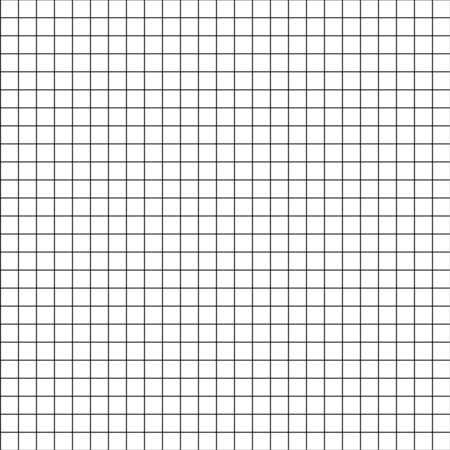

# 路径规划之 LPA_Star (LPA*)

LPA\*是A\*的增量版本. 相比于A\*算法, 首次规划时, 两者过程类似. 假如地图发生变化, A\*算法需要重新规划路径. 而LPA\*算法可以通过在当前搜索期间内更新前一次搜索的g值（距起始距离）来适应地图变化而无需重新计算整个地图。



## 算法描述

### 节点状态

局部连续（Locally Consistent）：$g(s)=rhs(s)$。当所有节点均为局部连续状态时，g(s)的值等于s到起始点的最短距离（注意，反向不成立）。这个概念很重要，当上述条件满足时，我们可以找到任意一点u到起始点的最短路径，假设当前位置为s,父辈节点s’(向着起始点前进的下一个节点)通过最小化(g(s’)+c(s,s’))来获得，不断重复直到到达sStart。然而，LPA*并不需要使所有节点均为局部连续状态，它通过启发式搜索将关注点放在搜索上，并且只更新那些与计算最短路径相关的节点的g值。

局部过连续（Locally Overconsistent）：$g(s)>rhs(s)$。当优先队列U中取出的节点为局部过连续状态时，意味着g(s)可以通过父辈节点使自己到起点的路径更短，此时将设置g(s)=rhs(s)，节点状态变为局部连续状态。

局部欠连续(Locally Underconsistent)：$g(s)<rhs(s)$。这种情况通常出现在父辈的某一节点突然变为障碍的情况下，造成父辈节点到起点的路径变大，从而需要修改g(s)的值，如果节点处于这种状态，则当它由优先队列中取出时，将其g值设置为无穷大，即将该节点状态变为局部过连续，而局部过连续的点将会被再次添加到优先队列中，这样就可以在它下次被取出时将其作为局部过连续状态处理，最终达到局部连续状态（如果这一节点与我们要搜索的最短路径相关的话）。

### 变量定义

LPA\*维持着每个节点的到起点的估计距离: [$g(s)$][1] 首次搜索时, $g(s)$的计算方式和A\*相同, 并将这个值带到下次搜索过程中. 
![algorithm_lpa_star_g][1]

此外LPA\*还维护着一个基于$g(s)$的前瞻估计距离: [$rhs(s)$][2]. 
![algorithm_lpa_star_rhs][2]

A\*算法维护着OPEN和CLOSED列表来避免节点被重复搜索. LPA\*通过检查局部一致性来避免节点重复搜索, 不需要维护COLSED列表. OPEN列表是一个优先队列, 使得A\*可以通过队列中具有最小$f(s)$值的节点来进行边的扩展. LPA\*也维持着一个只包含局部欠一致(locally inconsistent)节点的优先队列. 优先队列根据节点的keys值排列(相当于A\*的$f(s)$值排列). 该keys是一个二维变量:
> $k(s)=[k1(s),k2(s)]$

其中:
> $k1(s)=min(g(s),rhs(s)+h(s))$, 相当于A\*的$f(s)$
> $k2(s)=min(g(s),rhs(s))$, 相当于A\*的$g(s)$

定义: $k(s1) \leq (s2)$ 为 $k1(s1) \leq k1(s2)$ 或者 $(k1(s1)=k1(s2) \text{ and }k2(s1) \leq k2(s2))$

### 算法伪码
算法伪码如下图所示 [Algorithms LAP*][3]
![3]


[1]: img/algorithm_lpa_star_g.png
[2]: img/algorithm_lpa_star_rhs.png
[3]: img/algorithm_lpa_star.png


### 数据结构：

```python
class Node(object):
    def __init__(self, pos):
        self.pos = pos          # 当前节点的位置坐标
        self.g = float('inf')   # 当前节点的g(s),g_score
        self.h = float('inf')   # 当前节点的的h(s),h_score
        self.rhs = float('inf') # rhs(s)
        self.keys = [float('inf'), float('inf')]    # 优先队列keys(s)值
        self.p = None           # 当前节点的父节点
        self.is_obs = False     # 当前节点是否是障碍物
```

## 算法流程:

``` python
    '''
    map_path:   地图图片路径
    qstart:     起点坐标 [row, col]
    qgoal:      目标点坐标 [row, col]
    grid_size:  网格大小（用来碰撞检测）
    '''

    lpa_star = LPA_STAR(map_path, qstart, qgoal, grid_size)
    
```

### 步骤

+ 初始化`LPA_STAR.__init__`: 初始化地图，对地图图片二值化处理，网格节点划分，若网格内包含障碍物，则该网格节点标记为障碍物:  `Node.is_obs = True`
  
+ 输入需要随机产生的障碍物网格个数(可选);
  
+ `Initialize()`: 初始化所有节点的$g(s)=\infin$, $rhs(s)=\infin$, 实际实现中，不需要初始化所有节点，只需要在遇到一个新节点时初始化该节点. 起点$s_{start}$是一个局部欠一致节点, 计算$keys(s_{start})$, 并将节点$s_{start}$放入优先队列中. 

+ 初始化`Initialize()`保证了首次调用`ComputeShortestPath()`是一个A\*算法。
  
+ 等待地图更新， 这里通过用户输入障碍物网格数来模拟地图更新。

+ 地图更新时，导致节点之间的距离`DistanceCost`发生变化, 调用`UpdateVertex(s)`更新受影响节点参数`rhs`和`keys`。这也这些节点和优先队列之间的联系也发生变化，可能成为局部一致或者局部不一致状态。

+ 重新调用`ComputeShortestPath()`来根据优先队列顺序展开局部不一致的节点。 

  +  如果展开的节点处于局部过一致(`locally overconsistent`)状态, 即$g(s)>rhs(s)$, 那么将该节点设置为局部一致(`locally consistent`), 即$g(s)=rhs(s)$。

  +  如果展开的节点处于局部欠一致(`locally underconsistent`)状态，即$g(s)<rhs(s)$, 那么将该节点的`g`值设置为无穷大， 即$g(s)=\infin$

  +  上述两种情况中受该展开节点的`g`值变化会影响后置节点，所以还需要更新受其影响的节点，调用`UpdateVertex(s)`来更新。
  
+ LPA\*扩展停止条件为：目标节点$s_{goal}$处于局部一致并且下一个待展开的节点`keys`值不小于$s_{goal}$的`keys`值。若搜索结束之后目标节点$s_{goal}$的`g`值为无穷大，那路径不存在。

+ 将目标节点$s_{goal}$的后置链表反转即可得到$s_{start}$到$s_{goal}$的路径

### 图解

[第一次搜索][4]
![4]

[第二次搜索][5]
![5]


[4]: img/algorithm_lpa_star_first_search.png

[5]: img/algorithm_lpa_star_second_search.png


### 主要代码

```python

    def CalculateKey(self, s):
        '''
        the priority queue ordered by k1(f_score used in A*), then k2
        '''
        key2 = min([s.g, s.rhs])
        return [key2 + s.h, key2]

    def Initialize(self):
        '''
        init 
        '''
        self.U = []
        self.qstart.rhs = 0
        self.qstart.keys = [self.qstart.h, 0]
        self.U.append(self.qstart)

    def UpdateVertex(self, u):
        # u = copy.deepcopy(u)
        if u.pos != self.qstart.pos:
            new_rhs = float('inf')
            # predessors = self.Predessors(u)
            predessors = self.SuccessorsCollisionFree(u)
            for pred in predessors:
                tmp_rhs = pred.g + self.DistanceCost(pred, u)
                if tmp_rhs < new_rhs:
                    new_rhs = tmp_rhs
                    u.p = pred
            u.rhs = new_rhs

        for node_index, node in enumerate(self.U):
            if node.pos == u.pos:
                self.U.pop(node_index)
                break

        if u.g != u.rhs:
            u.keys = self.CalculateKey(u)
            self.UInsert(u)

        return

    def ComputeShortestPath(self):

        color_close = (random.randint(0, 255),
                       random.randint(0, 255),
                       random.randint(0, 255))

        while (len(self.U) != 0) and ((self.TopKey() < self.CalculateKey(self.qgoal)) or (self.qgoal.rhs != self.qgoal.g)):

            u = self.U.pop(0)
            self.DrawGrid(u.pos, color_close)

            if u.g > u.rhs:
                u.g = u.rhs
                successors = self.SuccessorsCollisionFree(u)
                for succ in successors:
                    self.UpdateVertex(succ)
            else:
                u.g = float('inf')
                self.UpdateVertex(u)
                successors = self.SuccessorsCollisionFree(u)
                for succ in successors:
                    self.UpdateVertex(succ)

        if self.qgoal.rhs == self.qgoal.g and self.qgoal.rhs != float('inf'):
            self.FindPath()
            print('Found Path')
            return True
        else:
            print('Not Found Path')
            return False

    def Planning(self):
        
        num = input("input obstacle numbers: ")
        try:
            input_num = eval(num)
            if type(input_num) == int:
                self.AddObstacle(input_num)
            else:
                return
        except:
            return

        while True:
            if self.ComputeShortestPath() == False:
                return

            num = input("input obstacle numbers: ")
            try:
                input_num = eval(num)
                if type(input_num) == int:
                    obstacle_set = self.AddObstacle(input_num)
                    for obs in obstacle_set:
                        successors = self.SuccessorsExcludeObstacle(obs)
                        for succ in successors:
                            self.UpdateVertex(succ)
                else:
                    return
            except:
                return
```
