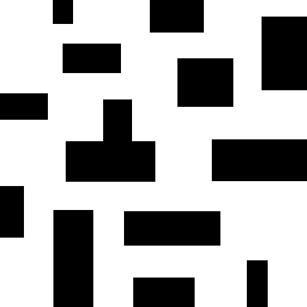
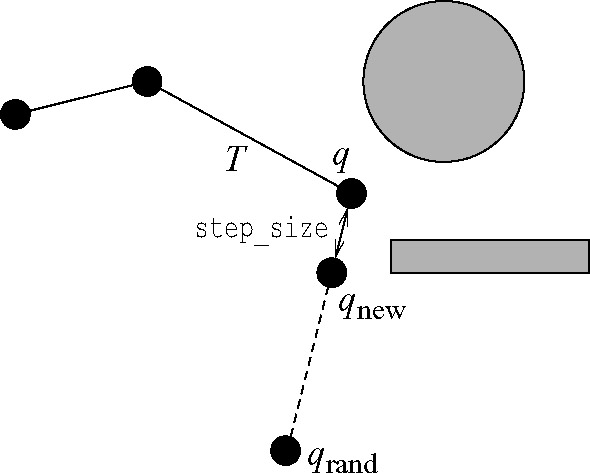

# 路径规划之 Rapidly-Exploring Random Trees (快速扩展随机树)

RRTs 作为一种 single-query 的规划算法被引入，它有效地覆盖了 q<sub>init</sub> 和 q<sub>goal</sub> 之间的空间。该规划器最初也是为 kinodynamic 运动规划而开发的，就像在 ESTs 中一样，只构建一棵树。RRTs 的适用范围超出了 kinodynamic 规划问题。RRT 算法已被证明是概率完备的。



## 算法描述

$T$表示一颗树。$T_{init}$和 $T_{goal}$根节分别为$q_{init}$和$q_{goal}$的树。每棵树$T$都是增量扩展的。在每次迭代中，在$Q_{free}$中随机均匀采样一点$q_{rand}$。在$T$中找到距离$q_{rand}$最近的节点$q_{near}$，并尝试从$q_{near}$向$q_{rand}$方向移动一段距离$step\_size$，生成一个新节点$q_{new}$。若该节点是无碰撞的(collision-free)，则添加节点$q_{new}$到$T$的顶点集合(vertices)中，添加$(q_{near}, q_{new})$到$T$的边集合(edges)中。下图展示了 RRT 在二维欧式空间扩展一个点的过程。



### 伪码


## 流程

1. 初始化随机树，树结点和边只包含起点$q_{start}$（根节点）。边和书中有一点区别，因为这里的节点用了一个链表结构，这里每个扩展节点($q_{new}$)包含有一个后向指针，指向源节点($q_{near}$)，所以不需要单独定义边。只要构造出树，最后反向遍历即可完成路径的构造。
2. 起始点start加入到树节点和边中
3. 开始迭代
4. `GenerateRandomNode()`: 在状态空间（机械臂的关节空间或者笛卡尔空间；小车可达的二维地图空间）中随机采样一个点$q_{rand}$。为加快RRT到达目标点$q_{goal}$的速度，在随机采样过程中，加随机的概率p来决定，此次扩展的目标点$q_{goal}$是随机点还是目标点$q_{goal}$。当$0<p<prob$时，取随机采样点；否则取目标点$q_{goal}$。这个概率不宜过大，否则容易陷入障碍物包围圈中不容易跳出。
5. `FindNearestNode(qrand)`: 遍历RRT树节点，返回距离$q_{rand}$最近的一个节点$q_{near}$
6. `ExtendTree(qnear, qrand)`: 沿着$(q_{near}, q_{rand})$方向，以一定的步长$step\_size$扩展一个新节点$q_{new}$, 如果扩展不成功（超出地图范围），返回None，放弃这次扩展。
7. `CollsionFree(qnear, qnew)`: 对$(q_{near}, q_{new})$路径进行碰撞检查，包括路径过程中及起始点是否有障碍物。这里采用等间距采样，检查路径中位置点所处网格是否包络障碍物。如果发生碰撞，则放弃扩展。
8. 如果新节点$q_{new}$被接受（新节点不为`None`且与$(q_{near}, q_{new})$之间的路径无碰撞），则将该点加入到树中，并将该节点的后向指针$q_{new}.parent$指向$q_{near}$。这样，在找到目标点时，根据该指针，可遍历得到完整的路径。为了防止树节点过多，可以再检查$q_{new}$是否与树中某个节点过于接近（一般取小于扩展步长），如果是，则也可以放弃此次扩展。但是这也会导致算法时间增长，毕竟要遍历树节点计算距离。
9. `IsArrival(qnew)`: 检查是否到达目标点$q_{goal}$, 如果新节点$q_{new}$距离目标点$q_{goal}$小于扩展步长$step\_size$，且无碰撞，则认为找到，将目标点$q_{goal}$作为树的最后一个节点添加到RRT树中。
10. `FindPath()`: 根据目标节点$q_{goal}$的反向指针，遍历至起点$q_{start}$，即完成路径的构造。
11. `SmoothPath(path)`: 上一步的路径是按照步长一个节点一个节点扩展的，因此这里可以对路径进行圆滑，遍历路径的节点，取最长不碰撞的节点构造新路径。


## 算法实现

### 数据结构

```python
class Node(object):
    def __init__(self, pos=[0, 0]):
        self.pos = pos
        self.parent = None
```

### 接口

``` python
    '''
    map_path: 地图图片路径
    qstart: 起点坐标 [row, col]
    qgoal: 目标点坐标 [row, col]
    grid_size: 网格大小（用来碰撞检测）
    step_size: 扩展步长
    max_steps: 最大扩展节点数
    goal_prob: 增加趋向目标点概率（贪婪）
    '''

    rrt = RRT(map_path, qstart, qgoal, grid_size,
              step_size, max_steps, goal_prob)
    
```

### Planning 

``` python
    def Planning(self):
        '''
        rrt planning
        '''
        self.AddVertices(self.qstart)
        self.AddEdges(None, self.qstart)

        k = -1
        while k < self.max_steps:
            k += 1
            qrand = self.GenerateRandomNode()
            _, qnear = self.FindNearestNode(qrand)
            qnew = self.ExtendTree(qnear, qrand)
            if qnew and self.CollsionFree(qnear, qnew):
                self.AddVertices(qnew)
                self.AddEdges(qnear, qnew)

                self.DrawEdges(qnear, qnew)

                if self.IsArrival(qnew):
                    print("Found")
                    self.AddVertices(self.qgoal)
                    self.AddEdges(qnew, self.qgoal)

                    path = self.FindPath()
                    self.DrawPath(path)
                    smooth_path = self.SmoothPath(path)
                    self.DrawPath(smooth_path)

                    return True
        print('Not Found')
        return False
```

