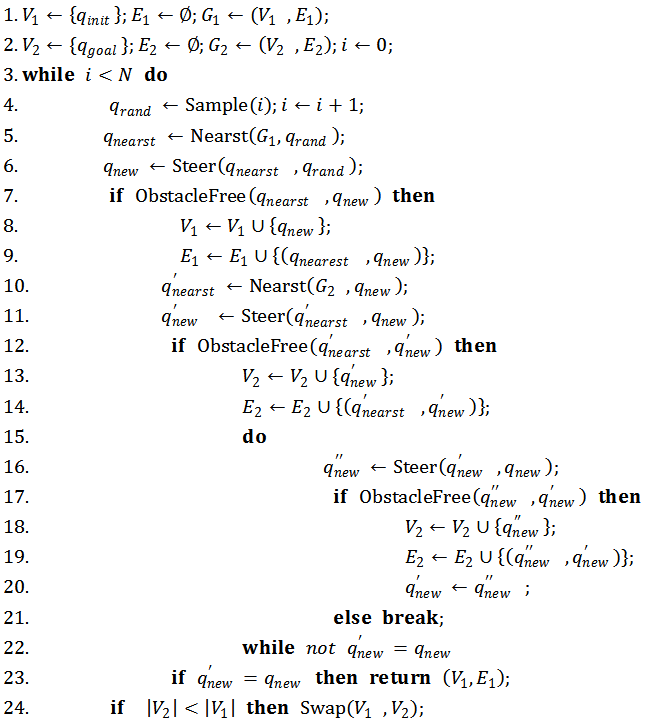

# 路径规划之 RRT_Connect (平衡双向快速扩展随机树)

单颗RRT树每次搜索只从初始节点开始在状态空间中快速随机扩展节点，带有一定的盲目性。RRT_Connect算法是一种基于双向扩展平衡的连结型双树(Balanced Bidirectional RRT)：两颗RRTs分别基于$q_{init}$和$q_{goal}$扩展；贪心启发式的连接方法使每棵树扩展时一次移动更长的距离。[作者](https://ieeexplore.ieee.org/document/844730)原文中举例了平面地图以及6-DOF的机械臂来验证RRT_Connect.


## 算法描述

分别在起点$q_{init}$和终点$q_{goal}$构造两棵树$T_1$和$T_2$，扩展节点方式同RRT。首先$T_1$从$q_{init}$随机采样$q_{rand}$作为目标点扩展一个新节点$𝑞_{𝑛𝑒𝑤}$，以这个新节点$𝑞_{𝑛𝑒𝑤}$作为第二棵树$T_2$的目标点来扩展新节点$𝑞^′_{𝑛𝑒𝑤}$。如果$𝑞^′_{𝑛𝑒𝑤}$没有碰撞，继续以$𝑞_{𝑛𝑒𝑤}$作为目标点扩展$T_2$，直到扩展失败(遇到障碍，进行下一次循环扩展)或者$𝑞^′_{𝑛𝑒𝑤}=𝑞_{𝑛𝑒𝑤}$(两棵树相连，即connect，整个算法结束)。每次扩展需要考虑两棵树的平衡性，节点多少或总路径的长度。交换次序，选择较短的树进行扩展。
首先，RRT_Connect算法以另一棵树的新节点作为目标点扩展，直到扩展失败。每次扩展更加贪婪，步长更长，使得树的生长更快；其次，两棵树不断朝向对方交替扩展，相比于随机扩展的方式具有一定的启发性质，特别当起始位姿和目标位姿处于约束区域时，两棵树可以通过朝向对方快速扩展而逃离各自的约束区域。

### 伪码



## 算法实现

### 数据结构

```python
class Node(object):
    def __init__(self, pos=[0, 0]):
        self.pos = pos
        self.parent = None
```

### 接口

``` python
    '''
    map_path: 地图图片路径
    qstart: 起点坐标 [row, col]
    qgoal: 目标点坐标 [row, col]
    grid_size: 网格大小（用来碰撞检测）
    step_size: 扩展步长
    max_steps: 最大扩展节点数
    goal_prob: 增加趋向目标点概率（贪婪）
    '''

    rrt_connect = RRT_CONNECT(map_path, qstart, qgoal, grid_size,
                              step_size, max_steps, goal_prob)
    
```

### Planning

``` python
    def Planning(self):
        '''
        RRT_CONNECT planning
        '''
        '''
        # 初始化两颗树：分别在起点qstart和终点qgoal构造两棵树,
        # 节点树分别记为vertices_t1和vetices_t2.
        '''
        vertices_t1 = []
        self.AddVertices(self.qstart, vertices_t1)
        self.AddEdges(None, self.qstart)

        vertices_t2 = []
        self.AddVertices(self.qgoal, vertices_t2)
        self.AddEdges(None, self.qgoal)

        '''
        # 开始迭代
        '''
        k = 0
        new_qgoal = self.qgoal
        while k <= self.max_steps:
            k += 1

            '''
            # 随机采样qrand_t1作为目标点，沿(qnear_t1, qrand_t1)方向,
            # 以step_size步长扩展第一棵树的节点qnew_t1. 
            '''
            qrand_t1 = self.GenerateRandomNode(
                [0, self.map_shape[0]], [0, self.map_shape[1]],
                new_qgoal, self.goal_prob)

            _, qnear_t1 = self.FindNearestNode(qrand_t1, vertices_t1)
            qnew_t1 = self.ExtendTree(qnear_t1, qrand_t1, self.step_size)

            '''
            # 检查qnew_t1是否扩展成功且没有碰撞
            '''
            if qnew_t1 and self.CollsionFree(qnear_t1, qnew_t1, self.grid_size):
                '''
                将qnew_t1加入到第一颗树vertices_t1中
                '''                
                self.AddVertices(qnew_t1, vertices_t1)
                self.AddEdges(qnear_t1, qnew_t1)

                self.DrawEdges(self.src_map, qnear_t1, qnew_t1)

                '''           
                # 以qnew_t1为目标点，沿(qnear_t2, qnew_t1)方向
                # 以step_size步长扩展第二棵树的节点qnew_t2.               
                '''
                k += 1
                _, qnear_t2 = self.FindNearestNode(qnew_t1, vertices_t2)
                qnew_t2 = self.ExtendTree(qnear_t2, qnew_t1, self.step_size)

                '''
                # 检查qnew_t1是否扩展成功且没有碰撞
                '''
                if qnew_t2 and self.CollsionFree(qnear_t2, qnew_t2, self.grid_size):
                    '''
                    # 将qnew_t1加入到第一颗树vertices_t1中
                    '''
                    self.AddVertices(qnew_t2, vertices_t2)
                    self.AddEdges(qnear_t2, qnew_t2)

                    self.DrawEdges(self.src_map, qnear_t2, qnew_t2)

                    '''
                    # 这里一直以qnew_t1为目标点，扩展qnew_t2，
                    # 除非qnew_t2扩展失败或qnew_t2到达qnew_t1。
                    # 扩展qnew_t2带有一定的贪婪特性，所以扩展树相比RRT更快速
                    '''
                    while k <= self.max_steps and self.IsArrival(qnew_t2, qnew_t1, self.step_size) == False:
                        k += 1

                        '''
                        # 以qnew_t1为目标点，沿(qnew_t2, qnew_t1)方向
                        # 以step_size步长扩展新节点qnew_mid.
                        '''
                        qnew_mid = self.ExtendTree(
                            qnew_t2, qnew_t1, self.step_size)
                        
                        '''
                        # 检查qnew_mid是否扩展成功且没有碰撞
                        '''
                        if qnew_mid and self.CollsionFree(qnew_t2, qnew_mid, self.grid_size):
                            '''
                            # 如果qnew_mid扩展成功，则将其加入到第二棵树中.
                            '''
                            self.AddVertices(qnew_mid, vertices_t2)
                            self.AddEdges(qnew_t2, qnew_mid)

                            self.DrawEdges(self.src_map, qnew_t2, qnew_mid)

                            '''
                            # 将第二棵树新扩展的节点qnew_mid作为qnew_t2继续扩展
                            '''
                            qnew_t2 = qnew_mid
                        else:
                            '''
                            # 如果qnew_mid扩展失败，则跳出该循环.
                            '''
                            break
                        
                '''
                检查两棵树是否相连,若相连，则完成路径规划
                '''   
                if self.IsArrival(qnew_t2, qnew_t1, self.step_size):
                    print("Found")
                    '''
                    # 如果两棵树连上了，说明找到路径了，把最后一个节点添加到树中。                    
                    '''
                    copy_qnew_t1 = copy.deepcopy(qnew_t1)
                    self.AddVertices(copy_qnew_t1, vertices_t2)
                    self.AddEdges(qnew_t2, copy_qnew_t1)

                    '''
                    # 合并两棵树，注意终点树的节点指针与起点树反向
                    '''
                    path = self.MergeTree(vertices_t1, vertices_t2)
                    self.DrawPath(self.src_map, path)

                    '''
                    # 路径圆滑
                    '''
                    smooth_path = self.SmoothPath(path, self.grid_size)
                    self.DrawPath(self.src_map, smooth_path)

                    return True
            '''
            # 当第二棵树扩展失败后，回到第一棵树扩展时，检查两棵树的节点个数，
            # 选择较短树进行扩展，使两棵树保持相对平衡。新的目标点为较长树的最后一个节点
            '''
            if (len(vertices_t2) < len(vertices_t1)):
                vertices_t2, vertices_t1 = vertices_t1, vertices_t2
                # edges_t2, edges_t1 = edges_t1, edges_t2

                new_qgoal = vertices_t2[-1]

        print("NotFound")
        return False
```


## 参考资料：
[1]: Kuffner J J , Lavalle S M . RRT-connect: An efficient approach to single-query path planning[C]// Proceedings 2000 ICRA. Millennium Conference. IEEE International Conference on Robotics and Automation. Symposia Proceedings (Cat. No.00CH37065). IEEE, 2002.  

